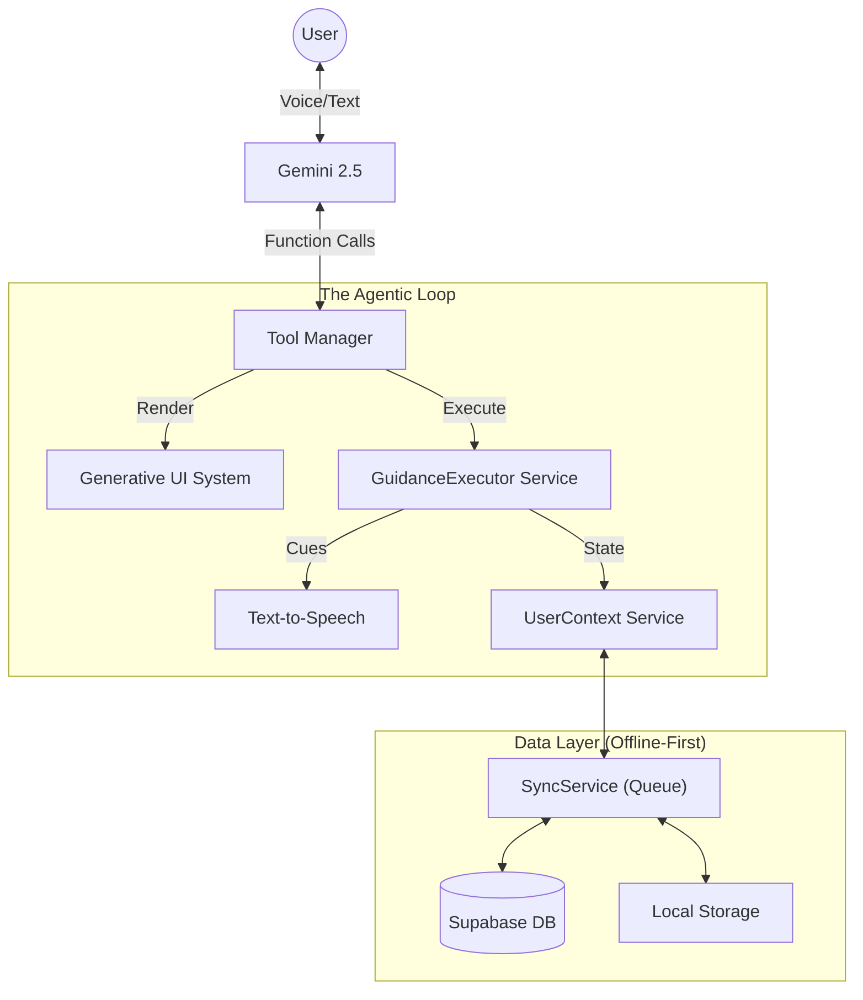

# 🧘🏃🏻 ZenFit

> **"Most fitness apps help you plan workouts. ZenFit helps you come back after you fall off."**

**ZenFit** is a **behavioral recovery system** for fitness. Instead of optimizing perfect workout plans, it optimizes the hardest moment in the journey: the restart after a missed day, a bad week, or a broken streak.

Most products try to make planning smarter; ZenFit is built around **re‑entry after failure**. It detects disengagement, lowers activation energy with tiny "re‑start" sessions, and then guides you through them hands‑free so showing up again feels almost inevitable.

Under the hood, ZenFit logs and evaluates real user–agent behavior with **Opik**, so we can measure whether ZenFit is actually reducing friction, repairing streaks, and staying safe—not just sounding supportive. (Details in the Opik section below.)

Built on **Google Gemini 2.5 Flash** and **Gemini Live**, ZenFit turns that behavioral loop into a live, voice‑driven experience with adaptive UI and stateful guidance.

---

## 🧠 The Behavioral Recovery Loop

1. **Detect disengagement**: Calendar + context notice missed sessions or “I fell off” language.
2. **Lower the barrier**: ZenFit proposes a tiny, time‑boxed re‑entry (e.g. a 5‑minute reset instead of a full workout).
3. **Guide the comeback**: During the session, ZenFit talks you through reps, breathing, and rest so you never need to touch your phone.
4. **Measure & improve**: Each interaction and live session is traced and scored in Opik so we can iterate on behaviors that actually bring people back.

---

## ✨ Key Capabilities

### 1. 🗣️ Real-Time "Live" Guidance
ZenFit solves the #1 problem with fitness apps: **Touching your phone with sweaty hands and getting distracted.**

*   **Hands-Free Coaching**: Using **Gemini Live**, ZenFit speaks to you in real-time.
*   **The `GuidanceExecutor` Engine**: Custom state machine drives the session. It doesn't just read text; it tracks:
    *   **Rep Counting**: "That's 5... 6... keep going!"
    *   **Pacing**: Adapts the counting speed to *your* actual movement speed.
    *   **Recovery**: Automatically triggers rest timers and breathing cues between sets.

### 2. 🎨 Generative UI
**"Text is for reasoning. UI is for compression."**

ZenFit has no static dashboards. Every interface element is **hallucinated** (generated) by the AI only when the context demands it:
*   **Need a plan?** → ZenFit renders a `WorkoutBuilder`.
*   **Ready to move?** → ZenFit swaps to a `Timer` or `WorkoutList`.
*   **Asking about progress?** → ZenFit draws a `HabitHeatmap` or `Chart`.

### 3. 🧩 Psychology-First Architecture
ZenFit builds a `UserContext` that tracks more than just steps. It follows a **"Three Pillars"** philosophy:
*   **Physical**: Movement, strength, and flexibility.
*   **Mental**: Stress management and emotional regulation.
*   **Recovery**: Sleep hygiene and active rest.

**Adaptive Logic**:
*   **Stressed?** → Pivots to Pillar 2 (Mindfulness/Breathing).
*   **Hesitant?** → Pivots to Pillar 1 (Minimum Viable Workout).
*   **Tired?** → Pivots to Pillar 3 (Recovery/Stretching).

---

## 🛠️ Technical Deep Dive

### 🏗️ Architecture



### ⚡ The "Offline-First" Sync Engine
Fitness happens everywhere—often where Wi-Fi is weak. Zenfit's `SyncService` ensures continuity:
1.  **Optimistic UI**: All actions (logging sets, chatting) happen instantly locally.
2.  **Operation Queue**: Actions are serialized into a persisting queue (Redux-style).
3.  **Auto-Replay**: When connectivity returns, the queue flushes to Supabase automatically.

### 🔒 Security & Privacy
*   **Auth**: Firebase Authentication (Google Sign-In).
*   **Data**: Row Level Security (RLS) policies on Supabase ensure you only access your own data.
*   **AI**: No personal data is used for model training; context is injected ephemerally.

---

## 🚀 Getting Started

### Prerequisites
*   Node.js 18+
*   Google Cloud Project (Gemini API)
*   Supabase Project
*   Firebase Project

### Installation

1.  **Environment Setup**
    Create `.env.local`:
    ```env
    # Core API Keys
    GEMINI_API_KEY=your_key_here
    VITE_SUPABASE_URL=your_url
    VITE_SUPABASE_ANON_KEY=your_key
    VITE_FIREBASE_API_KEY=your_firebase_key
    
    # Opik (Optional - for tracing/evaluation)
    OPIK_API_KEY=your_key
    OPIK_PROJECT_NAME=your_project_name
    OPIK_WORKSPACE=your_workspace_name

    # Google Calendar integration (server-side - see .env.example for detailed setup)
    SUPABASE_URL=your_supabase_url
    SUPABASE_SERVICE_ROLE_KEY=your_service_role_key
    GOOGLE_CLIENT_ID=your_google_oauth_client_id
    GOOGLE_CLIENT_SECRET=your_google_oauth_client_secret
    GOOGLE_OAUTH_REDIRECT_URI=https://your-app-domain.com/api/google/oauth/callback
    GOOGLE_OAUTH_STATE_SECRET=your_long_random_state_secret
    APP_BASE_URL=https://your-app-domain.com
    APP_REDIRECT_AFTER_OAUTH=/
    ```

2.  **Run Development Server**
    ```bash
    npm run dev
    ```

### Deployment (Vercel)
Zenfit is "Vercel-Ready".
1.  Import repo to Vercel.
2.  Add environment variables.
3.  Deploy.

---

## 📊 Opik integration (Evaluation & observability)

ZenFit uses [Opik](https://www.comet.com/docs/opik) for **tracing**, **evaluation**, and **prompt optimization** so we can measure and improve agent behavior systematically. When we improve scores in Opik, we're improving the very behaviors that help users **stick to their fitness resolutions**.

### What we trace
* **Chat**: Every request through `/api/opik/chat` (Vercel serverless or local dev API) is traced via `opik-gemini` (Node-only). Tool calls (renderUI, calendar, getEvents) and Gemini responses are captured.
* **Live sessions**: Each Live session is summarized and logged to an Opik experiment (`zenfit-live-obs-1`) with adherence-oriented scores.
* **Where**: Production → Vercel `/api/chat`; local → `npm run dev` + `npm run dev:api` with Vite proxying `/api` to the API server.

### What we evaluate (resolution-adherence metrics)
We run a **23-scenario eval** through the **real chat pipeline** (same as production) and log one **Opik experiment** with deterministic scores. These metrics are chosen so that improving them directly improves resolution adherence:
* **action_first**: Response includes a concrete action (timer, workoutList, workoutBuilder, chart) or renderUI — *deliver value without blocking on questions (Fogg: Behavior = Motivation × Ability × Prompt).*
* **tool_correctness**: Valid renderUI props (e.g. timer duration in seconds).
* **safety**: No medical/danger language; injury-like inputs get a provider/doctor/care mention — *no medical overreach (SHARP/FDA-style).*
* **friction**: Low-energy prompts (“I’m tired”) get short sessions (e.g. timer ≤ 10 min) — *lower barrier, less drop-off (Duolingo-style).*
* **empathy** & **reengage_support**: For “I fell off” / “streak broke” we expect supportive, re-entry language — *streak repair, no shame.*

### How to run the eval
```bash
# Env: GEMINI_API_KEY (or API_KEY), OPIK_API_KEY, OPIK_PROJECT_NAME, OPIK_WORKSPACE (if required)
npm run eval:opik
```

### Agent Optimizer
We use the **Opik Agent Optimizer** (MetaPrompt) to improve the Zen system prompt; the best-performing prompt is deployed to our production agent.
* **Dataset**: Same resolution-aligned scenarios (`zenfit-optimizer-dataset`).
* **Metric**: Composite (action_first + safety + relevance).
* **Run**: `python scripts/opik-optimizer/run_optimizer.py` (Python 3.10+, `pip install -r scripts/opik-optimizer/requirements.txt`, then `opik configure`). Env: `OPIK_API_KEY`, `GEMINI_API_KEY` or `OPENAI_API_KEY`.

Results appear under **Evaluation → Optimization runs** in the Opik dashboard.

### How Opik improves ZenFit
We trace every chat and log Live session summaries; we run the 23-scenario eval and log experiments; we use the Agent Optimizer to improve our system prompt and deploy the best variant. So **Opik directly drives the behaviors that help users stick** — action first, low friction, re-engagement support, and safety. For judging: link to our Opik project and screenshots of **Traces**, **Experiments** (e.g. `zenfit-eval-run-2`), and **Optimization runs** are in the submission or under `docs/opik/`.
