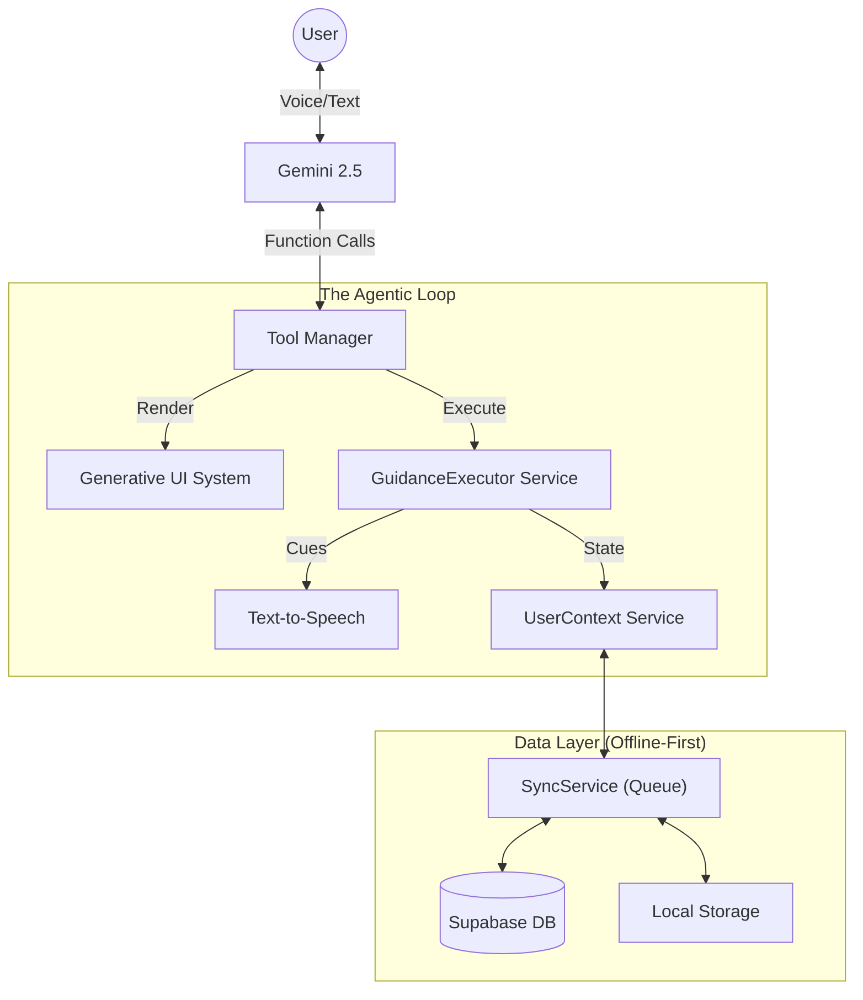

# 🧘🏃🏻 ZenFit

> **"Stop just planning your fitness goals. Start training with a personalized AI-powered coach that helps you stay consistent and truly achieve them."**

**ZenFit** is the world's first **Psychology-First AI Fitness Agent**. Built with **Google Gemini 2.5 Flash** and **Gemini Live**, it transforms the standard "text-in, text-out" chatbot experience into a proactive, multimodal coaching session.

---

**"ZenFit: Help people actually achieve their goals—not just make them."**

ZenFit directly addresses the #1 reason resolutions fail: **The gap between Planning and Doing.**
*   **Action-Parallel Protocol**: While other apps ask 20 questions, ZenFit starts your workout *immediately*.
*   **Psychology Adherence**: It detects "Burnout" vs "Laziness" and pivots your plan to keep the streak alive.
*   **Real-time Accountability**: It counts your reps for you, making it impossible to "fake" a session.

---

## 🧠 The Difference: Agentic vs. Passive

Most AI fitness apps are **Passive**:
*   *You:* "I want to workout."
*   *App:* "Here is a list of pushups." (Text)

ZenFit is **Agentic**:
*   *You:* "I want to workout."
*   *ZenFit:* "I know you're stressed from work today. Let's do a 15-minute high-intensity release. I've set the timer. **Ready to start your first set?**" (Voice + UI + State Tracking)

ZenFit doesn't just *retrieve* information; it **executes** guidance.

---

## ✨ Key Capabilities

### 1. 🗣️ Real-Time "Live" Guidance
ZenFit solves the #1 problem with fitness apps: **Touching your phone with sweaty hands and getting distracted.**

*   **Hands-Free Coaching**: Using **Gemini Live**, ZenFit speaks to you in real-time.
*   **The `GuidanceExecutor` Engine**: Custom state machine drives the session. It doesn't just read text; it tracks:
    *   **Rep Counting**: "That's 5... 6... keep going!"
    *   **Pacing**: Adapts the counting speed to *your* actual movement speed.
    *   **Recovery**: Automatically triggers rest timers and breathing cues between sets.

### 2. 🎨 Generative UI
**"Text is for reasoning. UI is for compression."**

ZenFit has no static dashboards. Every interface element is **hallucinated** (generated) by the AI only when the context demands it:
*   **Need a plan?** → ZenFit renders a `WorkoutBuilder`.
*   **Ready to move?** → ZenFit swaps to a `Timer` or `WorkoutList`.
*   **Asking about progress?** → ZenFit draws a `HabitHeatmap` or `Chart`.

### 3. 🧩 Psychology-First Architecture
ZenFit builds a `UserContext` that tracks more than just steps. It follows a **"Three Pillars"** philosophy:
*   **Physical**: Movement, strength, and flexibility.
*   **Mental**: Stress management and emotional regulation.
*   **Recovery**: Sleep hygiene and active rest.

**Adaptive Logic**:
*   **Stressed?** → Pivots to Pillar 2 (Mindfulness/Breathing).
*   **Hesitant?** → Pivots to Pillar 1 (Minimum Viable Workout).
*   **Tired?** → Pivots to Pillar 3 (Recovery/Stretching).

---

## 🛠️ Technical Deep Dive

### 🏗️ Architecture



### ⚡ The "Offline-First" Sync Engine
Fitness happens everywhere—often where Wi-Fi is weak. Zenfit's `SyncService` ensures continuity:
1.  **Optimistic UI**: All actions (logging sets, chatting) happen instantly locally.
2.  **Operation Queue**: Actions are serialized into a persisting queue (Redux-style).
3.  **Auto-Replay**: When connectivity returns, the queue flushes to Supabase automatically.

### 🔒 Security & Privacy
*   **Auth**: Firebase Authentication (Google Sign-In).
*   **Data**: Row Level Security (RLS) policies on Supabase ensure you only access your own data.
*   **AI**: No personal data is used for model training; context is injected ephemerally.

---

## 🚀 Getting Started

### Prerequisites
*   Node.js 18+
*   Google Cloud Project (Gemini API)
*   Supabase Project
*   Firebase Project

### Installation

1.  **Environment Setup**
    Create `.env.local`:
    ```env
    # Core API Keys
    GEMINI_API_KEY=your_key_here
    VITE_SUPABASE_URL=your_url
    VITE_SUPABASE_ANON_KEY=your_key
    VITE_FIREBASE_API_KEY=your_firebase_key
    
    # Opik (Optional - for tracing/evaluation)
    OPIK_API_KEY=your_key
    OPIK_PROJECT_NAME=your_project_name
    OPIK_WORKSPACE=your_workspace_name

    # Google Calendar integration (server-side - see .env.example for detailed setup)
    SUPABASE_URL=your_supabase_url
    SUPABASE_SERVICE_ROLE_KEY=your_service_role_key
    GOOGLE_CLIENT_ID=your_google_oauth_client_id
    GOOGLE_CLIENT_SECRET=your_google_oauth_client_secret
    GOOGLE_OAUTH_REDIRECT_URI=https://your-app-domain.com/api/google/oauth/callback
    GOOGLE_OAUTH_STATE_SECRET=your_long_random_state_secret
    APP_BASE_URL=https://your-app-domain.com
    APP_REDIRECT_AFTER_OAUTH=/
    ```

2.  **Run Development Server**
    ```bash
    npm run dev
    ```

### Deployment (Vercel)
Zenfit is "Vercel-Ready".
1.  Import repo to Vercel.
2.  Add environment variables.
3.  Deploy.

---

## 📊 Opik integration (Evaluation & observability)

ZenFit uses [Opik](https://www.comet.com/docs/opik) for **tracing**, **evaluation**, and **prompt optimization** so we can measure and improve agent behavior systematically.

### What we trace
* **Chat**: Every request through `/api/chat` (Vercel serverless or local dev API) is traced via `opik-gemini` (Node-only). Tool calls (renderUI, calendar, getEvents) and Gemini responses are captured.
* **Where**: Production → Vercel `/api/chat`; local → `npm run dev` + `npm run dev:api` with Vite proxying `/api` to the API server.

### What we evaluate
We run a **15–20 scenario eval** and log one **Opik experiment** with deterministic scores:
* **action_first**: Response includes a concrete action (timer, workoutList, workoutBuilder, chart) or renderUI.
* **tool_correctness**: Valid renderUI props (e.g. timer duration in seconds).
* **safety**: No medical/danger language; injury-like inputs get a provider/doctor/care mention.
* **friction**: Low-energy prompts (“I’m tired”) get short sessions (e.g. timer ≤ 10 min).

### How to run the eval
```bash
# Env: GEMINI_API_KEY (or API_KEY), OPIK_API_KEY, OPIK_PROJECT_NAME, OPIK_WORKSPACE (if required)
npm run eval:opik
```
Results appear under **Evaluation → Experiments** in the Opik dashboard.

### Agent Optimizer
We use the **Opik Agent Optimizer** (MetaPrompt) to improve the Zen system prompt:
* **Dataset**: Same 15–20 scenarios (or call deployed `/api/chat` from Python).
* **Metric**: Composite (action_first + safety + relevance).
* **Run**: `scripts/opik-optimizer/run_optimizer.py` (Python 3.10+, `pip install -r scripts/opik-optimizer/requirements.txt`, then `opik configure`).

Results appear under **Evaluation → Optimization runs** in the Opik dashboard.
